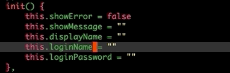

# What is smart-align?
In normal way, we need do below steps when align block:
1. Select the region.
2. Type M-x align-regexp RET
3. Type = and hit enter.

I hate select region by hand,
too many cursor movement operations are too inefficient.

So i develop this plugin that you only need do ```smart-align``` in cursor.
This plugin will found block bound around cursor,
then call `align-regexp' with = regexp.

## Installation
Clone or download this repository (path of the folder is the `<path-to-smart-align>` used below).

In your `~/.emacs`, add the following two lines:
```Elisp
(add-to-list 'load-path "<path-to-smart-align>") ; add smart-align to your load-path
(require 'smart-align)
```

## Usage
Bind your favorite key to functions:

| Function    | Description                 |
| :--------   | :----                       |
| smart-align | Align current block smartly |
